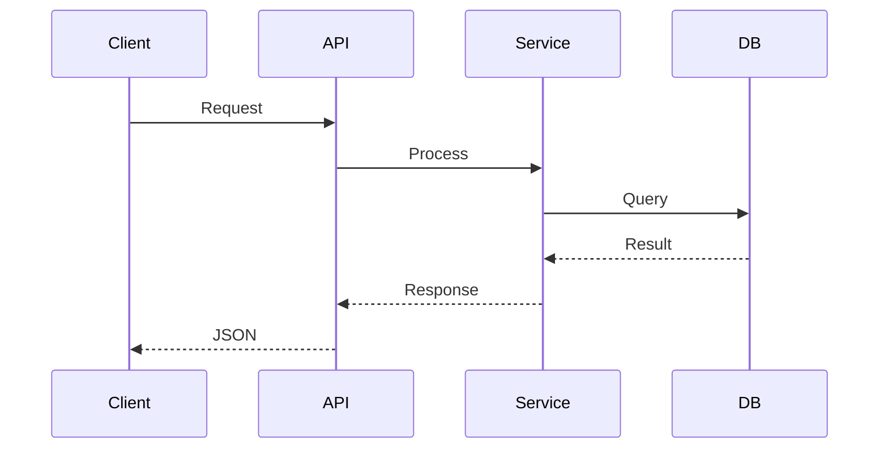
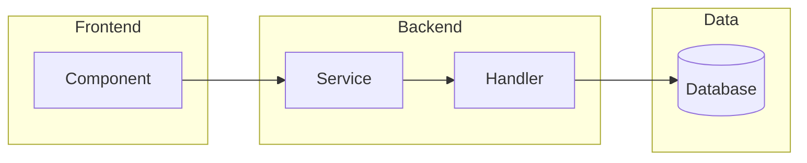
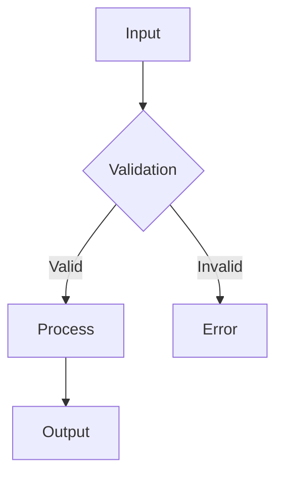

# Create Pull Request

Create a well-structured pull request with automatic architectural diagram detection.

## Process

### 1. Analyze Changes

First, gather context about the current branch:

```bash
# Get branch info
git branch --show-current
git log origin/main..HEAD --oneline
git diff origin/main..HEAD --stat

# Check if branch is pushed
git rev-parse --abbrev-ref --symbolic-full-name @{u} 2>/dev/null || echo "NOT_PUSHED"
```

Read the full diff to understand the changes:

```bash
git diff origin/main..HEAD
```

### 2. Detect Architectural Changes

Analyze the diff for architectural changes that warrant a Mermaid diagram:

**Include diagram if ANY of these are true:**
- New services, modules, or major components added
- Changes to data flow between components
- New API endpoints or significant API changes
- Database schema changes
- New integrations with external services
- Changes to authentication/authorization flow
- New event handlers or message queues

**Skip diagram if:**
- Only bug fixes or small tweaks
- Documentation-only changes
- Style/formatting changes
- Test-only changes
- Simple CRUD additions

### 3. Push Branch (if needed)

If the branch is not pushed to remote, ask the user:

**Use AskUserQuestion tool:**
- Question: "Branch not pushed to remote. Push now to create PR?"
- Options: "Yes, push and continue" / "No, cancel"

If yes, push with:
```bash
git push -u origin $(git branch --show-current)
```

### 4. Generate PR Content

Create a PR with this structure:

**Title format:** `<type>: <short description>` (max 70 chars)

Types:
- `feat` - New feature
- `fix` - Bug fix
- `refactor` - Code restructuring
- `docs` - Documentation
- `chore` - Maintenance
- `perf` - Performance improvement
- `test` - Test changes

**Body format:**

```markdown
## Summary

<2-4 bullet points describing the main changes>

## Changes

<More detailed breakdown if needed>

## Architectural Impact

<If architectural changes detected, include Mermaid diagram>

```mermaid
<diagram here>
```

## Test Plan

- [ ] <How to test this PR>
- [ ] <Edge cases considered>

---
Generated with [Claude Code](https://claude.ai/code)
```

### 5. Create the PR

Use `gh pr create`:

```bash
gh pr create --title "<title>" --body "$(cat <<'EOF'
<body content here>
EOF
)"
```

### 6. Output

After creating, output:
- PR URL
- Summary of what was included
- Note if diagram was added

## Mermaid Diagram Guidelines

When creating diagrams:

**For API/Service changes:**


**For Component/Architecture changes:**


**For Data flow changes:**


Keep diagrams simple and focused on what changed, not the entire system.

## Important

- **Always use AskUserQuestion** when clarification is needed
- Never create empty or placeholder PRs
- If you can't determine the changes, ask the user to explain
- Respect existing PR templates in `.github/PULL_REQUEST_TEMPLATE.md` if present
